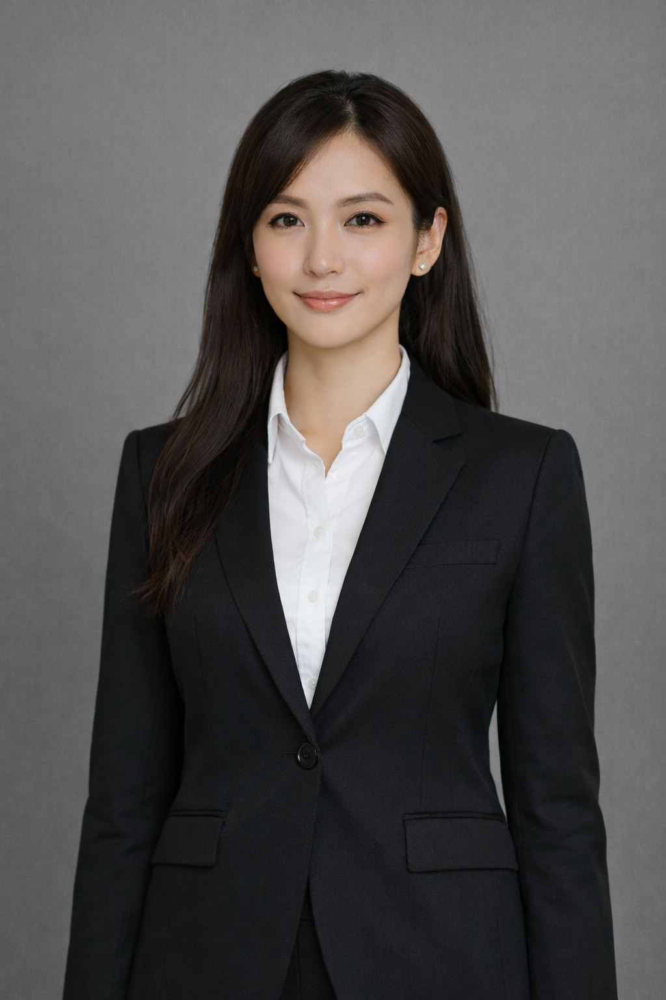
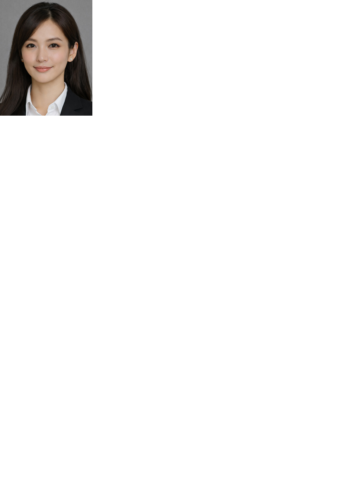

# 自宅で証明写真を作って印刷しよう

スマホやカメラで撮った写真を入力するだけで、証明写真サイズにトリミングし、**自宅のプリンターでピッタリのサイズで印刷できる**スクリプトです。写真館やコンビニに行かずに、証明写真を手軽に自作できます。

| 変換前 (`photo.jpg`) | 変換後 (`output.png`) |
|:---:|:---:|
|  |  |

## 機能

- YOLOv8 ポーズ推定で頭頂・肩のキーポイントを検出し、自動でクロップ
- アスペクト比を保ったままリサイズ（LANCZOS）
- 証明写真を指定用紙サイズの白背景左上に配置してPNG出力
- 対話形式でプリンター・用紙サイズ・給紙トレイ・印刷品質を選択して直接印刷
- Linux (CUPS) および WSL2 (Windows プリンター) 両対応

## 必要環境

- Python 3.11 以上
- [uv](https://docs.astral.sh/uv/)
- 印刷する場合: CUPS (`lp`, `lpoptions`) または WSL2 環境

依存ライブラリ（uv が自動インストール）:

| ライブラリ | 用途 |
|---|---|
| ultralytics | YOLOv8 ポーズ推定 |
| Pillow | 画像処理・PNG出力 |
| numpy | 配列処理 |
| torch | YOLOv8 実行バックエンド |
| torchvision | YOLOv8 実行バックエンド |

## 使い方

```bash
uv run main.py <入力画像> [<出力PNG>]
```

出力PNGを省略すると、カレントディレクトリに `id_photo_output.png` として保存されます。

**例:**

```bash
uv run main.py photo.jpg
```

### 実行フロー

実行すると、以下の順で対話形式で設定を選択します。

```
【プリンターを選んでください】
  1. Canon_TR8600
  2. HP_LaserJet
番号を入力してください: 1

【印刷用紙のサイズを選んでください】
  1. L (89.0mm × 127.0mm)
  2. KG (102.0mm × 152.0mm)
  3. A4 (210.0mm × 297.0mm)
番号を入力してください: 1

【証明写真のサイズを選んでください】
  1. 標準（縦30mm × 横24mm (3.0cm×2.4cm)）
  2. パスポート・マイナンバー（縦45mm × 横35mm (4.5cm×3.5cm)）
  3. 履歴書用・大（縦55mm × 横40mm (5.5cm×4.0cm)）
  4. カスタム入力
番号を入力してください: 1
```

用紙サイズ選択後、画像を生成してプレビューを自動表示。その後、給紙トレイ・印刷品質を選択し、印刷確認のうえ印刷します。

```
【給紙トレイを選んでください】
  1. Auto
  2. Cassette
番号を入力してください: 1

【印刷品質を選んでください】
  1. 標準 (Medium) (600×600 dpi)
  2. 高品質 (High) (1200×1200 dpi)
番号を入力してください: 2

【印刷してもよいですか？（用紙・電源を確認してください）】
  1. はい、印刷する
  2. いいえ、中止する
番号を入力してください: 1
```

初回実行時に `yolov8n-pose.pt` モデルが自動ダウンロードされます。

## 出力仕様

| 項目 | 値 |
|---|---|
| 証明写真サイズ | 標準 / パスポート・マイナンバー / 履歴書用・大 / カスタム（選択式） |
| 用紙サイズ | プリンタードライバーから取得（L版 / 2L版 / ハガキ / A4 など） |
| 解像度 | 300 DPI |
| フォーマット | PNG |
| 証明写真の位置 | 左上 |
| 背景色 | 白 |

## クロップのしくみ

1. YOLOv8 (`yolov8n-pose.pt`) で人物のポーズキーポイント17点を推定
2. バウンディングボックスの上端から頭頂部を決定
3. 両肩のキーポイント（信頼度0.3以上）から肩の下端・水平中心を決定
4. 頭上に5%・肩下に2%の余白を加え、指定アスペクト比に合わせた矩形でクロップ
5. ズーム係数1.1で中心固定拡大し、LANCZOS でリサイズ
6. 指定用紙サイズの白背景キャンバス左上に貼り付け

## エラー

| メッセージ | 原因 |
|---|---|
| `人物を検出できませんでした。` | 画像に人物が写っていない、または検出信頼度が低い |
| `肩を検出できませんでした。` | 上半身が写っていない、または肩の検出信頼度が低い（0.3未満） |
